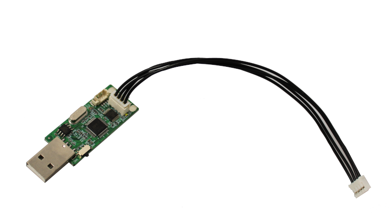
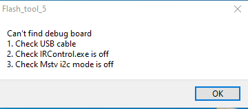
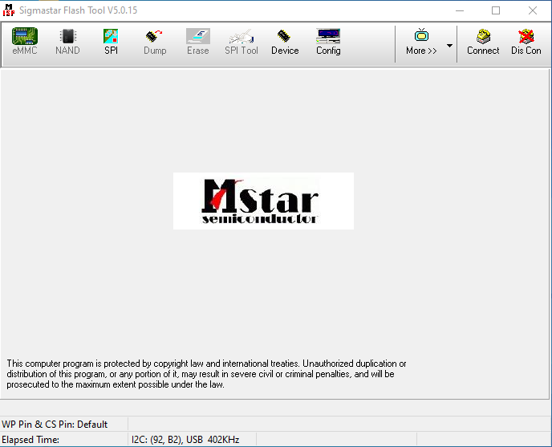
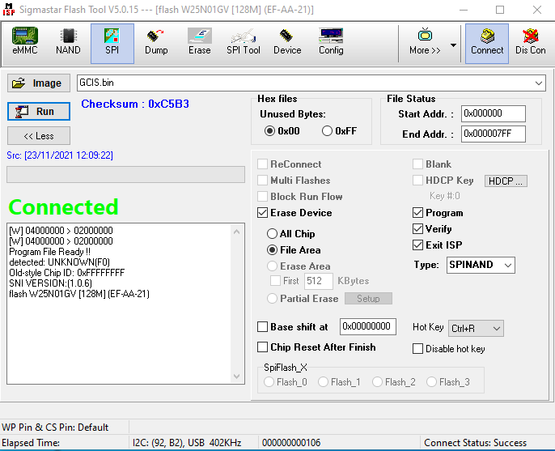
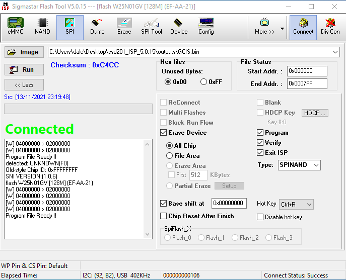
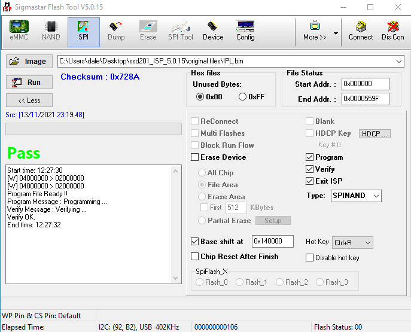
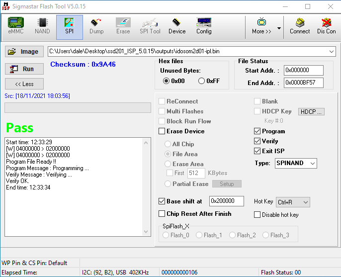

# Flashing IDO-SOM2D01

This tutorial will explain what you need to do on empty or already flashed module to get latest Linux kernel up and runing.

# EMPTY MODULE

If you have empty module when you connect it to UART you should get some weird output from it
```
<0xfc><break>
<0x1c><break>
<0xe0><0x1c><0x1c><0x1c><0xfc><0x1c><0x1c><0xe0><0x1c><break>
<0x1c><break>
<0x1c><0xe0><0xe0><0x1c><break>
<0x1c><0xe0><break>
<0x1c><break>
<0x1c><0xe0><0x1c><0x1c><break>
<0x1c><0x1c><0x1c><break>
<0x1c><0x1c><0x1c><0x1c><0x1c><0x1c><0x1c><break>
<0xe0><0x1c><break>
<0xe0><0x1c><break>
<0xfc><0xe0><0x1c><break>
<0x1c><0x1c><0x1c><0x1c><0xe0><0xe0><0x1c><break>
<0x1c><0xfc><0xe0><0x1c><0xe0><0x80><0x1c><break>
<0xe0><0x1c><0x1c><0x1c><0xfc><0xfc><0x1c><0xe0><0xfc><0x1c>p<0xfe><0x1c><break>
<0xe0><0xe0><0xe0><0x1c><break>
<0x1c><0xe0><0xfc><0x1c><0xf0><0xfc><0x1c><0x1c><0xfc><0x1c>p<0xf0><0x1c><break>
<0xe0><break>
<0xe0><0xfc><0xfc><0x8e><break>
<0xe0><0x1c><break>
<0x1c><0xe0><0xe0><0x1c><0xe0><0x8e><0x1c><0xfc><0x1c><0x1c><break>
<0xe0><0x1c><break>

```

or in some cases like this (depends what terminal/UART are you using)
```
Welcome to minicom 2.7.1

OPTIONS: I18n 
Compiled on Dec 23 2019, 02:06:26.
Port /dev/ttyUSB1, 11:33:57

Press CTRL-A Z for help on special keys

�����������������������p���������                                              �
```

After this you can connect SigmaStar/MStar USB Debug Tool that looks like this
And you can buy it from AliExpress/TaoBao...
I have bought from makers of module WirelessTag
https://item.taobao.com/item.htm?id=631665290641



Tools and files needed for this tutorial can be downloaded from manufacturer documentation site

http://doc.industio.com/docs/ssd20x_manual/ssd20x_manual-1cradqrvf230l

When you open ISP Flash Tool 5.0.0.x you will get warning if tool is not inserted in USB on PC



So I suggest opening tool after USB Debug Tool is plugged in
When you open ISP Flash Tool


You will have status bar with I2C: (92, B2), USB 402Khz (or similar) at bottom what means all is ready

After that you can press `Connect` and status windows should change as below


## Flashing GCIS.bin
Next we can choose 1st file to flash module and that is `GCIS.bin` that can be found in SpinandPackBinTool


1) Select Image file (GCIS.bin/2kB) (I have moved mine to be inside ISP tool folder but you don't need to do that)
2) Make sure that `Erase Device` is checked and `All Chip` is selected under
3) `Base shift at` should be checked and left as `0x00000000`
4) If All is done press `Run` in top left corner under `Image`

After some time you will get green `PASS` and some logging under
```
Start time: 12:18:29
[W] 04000000 > 02000000
[W] 04000000 > 02000000
Program File Ready !!
Erase Message : Erasing ...
Erase OK.
Program Message : Programming ...
Verify Message : Verifying ...
Verify OK.
End time: 12:18:36
```
With this 1st stage is done so we can continue to next step

## Flashing IPL
1) Select IPL.bin (21.9kB) that can be found in SpinandPackBinTool also
2) Make sure that `Erase Device` is NOT checked 
3) `Base shift at` should be changed to: `0x140000`
4) Press `Run` and that should be it



## Flashing idosom2d01-ipl.bin
This is uBoot SPL that is called `idosom2d01-ipl` in outputs folder and need to add extension `.bin` so tool can burn it

1) Select idosom2d01-ipl.bin (40-50kB) that can be found in Github release section or build your own
2) Make sure that `Erase Device` is NOT checked 
3) `Base shift at` should be changed to: `0x200000`
4) Press `Run` and that should be it



## Next steps

Now you can disconnect and reboot your module that should boot into uBoot emergency loader from UART
```
IPL g5da0ceb
D-1d
HW Reset
miupll_166MHz
miu_bw_set
utmi_1_init done
utmi_2_init done
utmi_3_init done
usbpll init done......
cpupll init done
SPI 54M
clk_init done 
P1 USB_rterm trim=0x0000
P1 USB_HS_TX_CURRENT trim=0x000e                                                
P2 USB_rterm trim=0x0001                                                        
P2 USB_HS_TX_CURRENT trim=0x0000                                                
P3 USB_rterm trim=0x0001                                                        
P3 USB_HS_TX_CURRENT trim=0x0000                                                
PM_vol_bgap trim=0x0003                                                         
GCR_SAR_DATA trim=0x0190                                                        
ETH 10T output swing trim=0x0000                                                
ETH 100T output swing trim=0x0000                                               
ETH RX input impedance trim=0x0000                                              
ETH TX output impedance trim=0x0000                                             
MIPI_HS_RTERM trim=0x0001                                                       
MIPI_LP_RTERM trim=0x0000                                                       
64MB                                                                            
BIST0_0001-OK                                                                   
Enable MMU and CACHE                                                            
Load IPL_CUST from SPINAND                                                      
unable to find IDX for part type:0001                                           
[I]m7                                                                           
Checksum OK                                                                     
!                                                                               
U-Boot SPL 2021.01-rc4 (Nov 06 2021 - 15:45:25 +0000)                           
                                                                                
cpuid: 410fc075, mstar chipid: f0                                               
normal power on                                                                 
wrote 1f206540 <- 4bc7 was 4bc7, readback 4bc7                                  
wrote 1f206544 <- 0037 was 0037, readback 0037                                  
wrote 1f206548 <- b3d5 was 0000, readback b3d5                                  
wrote 1f20654c <- 0043 was 0000, readback 0043                                  
wrote 1f206560 <- 0001 was 0000, readback 0001                                  
wrote 1f206554 <- 0006 was 0006, readback 0006                                  
wrote 1f20655c <- 0008 was 0008, readback 0008                                  
wrote 1f206564 <- 1000 was 0000, readback 1000                                  
wrote 1f206550 <- 0000 was 0000, readback 0000                                  
wrote 1f206550 <- 0001 was 0000, readback 0001                                  
wrote 1f20442c <- 0001 was 0000, readback 0001                                  
wrote 1f203ddc <- 0004 was 0000, readback 0004                                  
wrote 1f203dd4 <- 4004 was 0000, readback 4004                                  
wrote 1f203dd8 <- 0001 was 0000, readback 0001                                  
wrote 1f203dc0 <- 0000 was 0000, readback 0000                                  
wrote 1f203dc0 <- 8000 was 0000, readback 8000                                  
delaying for 100                                                                
readback: 4277                                                                  
mplldbg 2                                                                       
mpll: 0 - 68b24023                                                              
mpll: 4 - 778381c                                                               
mpll: 8 - 11a030                                                                
mpll: c - a0005578                                                              
mpll: 10 - 34b81ef                                                              
Trying to boot from SPI NAND(UBI)        
.....
.....
..... (there will be a lot of logging at least in my case for Winbond SPI NAND)
.....
.....
UBI: Loading VolId #0                                                           
UBI warning: LEB 0 of 1 is missing                                              
UBI warning: Failed to load volume 0                                            
UBI warning: Failed                                                             
Trying to boot from UART 
C
```

## You need to send idosom2d01-u-boot.img via serial
I've using minicom on Linux with following steps (if can't run normally try with sudo minicom -s)
After Trying to boot from UART message in minicom pres `Ctrl+A` then press `s`
you will be prompted with popup where you need to select `ymodem` and then go all way top and press enter to get file dialog (here paste your file location will be easier then type all into) and press enter
After this you will get dialog with progress that will take maybe 1-2min
```
U-Boot 2021.01-rc4 (Nov 06 2021 - 15:45:25 +0000)
DRAM:  64 MiB
wrote 1f206540 <- 4bc7 was 4bc7, readback 4bc7
wrote 1f206544 <- 0037 was 0037, readback 0037
wrote 1f206548 <- b3d5 was b3d5, readback b3d5
wrote 1f20654c <- 0043 was 0043, readback 0043
wrote 1f206560 <- 0001 was 0001, readback 0001
wrote 1f206554 <- 0006 was 0006, readback 0006
wrote 1f20655c <- 0008 was 0008, readback 0008
wrote 1f206564 <- 1000 was 1000, readback 1000
wrote 1f206550 <- 0000 was 0001, readback 0000
wrote 1f206550 <- 0001 was 0000, readback 0001
wrote 1f20442c <- 0001 was 0001, readback 0001
wrote 1f203ddc <- 0004 was 0004, readback 0004
wrote 1f203dd4 <- 4004 was 4004, readback 4004
wrote 1f203dd8 <- 0001 was 0001, readback 0001
wrote 1f203dc0 <- 0000 was 8000, readback 0000
wrote 1f203dc0 <- 8000 was 0000, readback 8000
delaying for 100
readback: 4277
mpll here!
mpll here xxxx!
checking 22f8e370 22f8e370
found parent at 0
mpll is already running
MMC:   
Loading Environment from UBI... spi_nand spi_flash@0: unknown raw ID 22f8f618
Could not find a valid device for spi-nand0
Partition UBI not found!

** Cannot find mtd partition "UBI"
In:    uart@221000
Out:   uart@221000
Err:   uart@221000
Net:   checking 22f8ee88 22f8ee88
found parent at 0
emac patches
rx ring 22f92e40

Warning: emac@2a2000 (eth0) using random MAC address - 02:93:96:a6:be:f9
eth0: emac@2a2000
=> 
```

Here you can use ethernet to load `kernel-rescue` but for me that didn't work I was getting timeout...
```
=> dhcp
emac@2a2000: PHY present at 0
PHY reset timed out
phy power up
emac@2a2000: Starting autonegotiation...
emac@2a2000: Autonegotiation timed out (status=0x78c9)
emac@2a2000: link down (status: 0x78c9)
=>
```

So I have to use serial and that took about 10min to load kernel-rescue via UART
```
setenv loadaddr 0x22000000; loady; bootm
```

After this step you should be able to use rescue image to complete flashing

**Note**

If UART log stop loading or it looks like it is frozen just type few times `Enter` key and you should be presented with login screen
```
Welcome to Buildroot                                                            
buildroot login: 
```

Enter `root` and we can start finishing flashing

This is set of commands you need to enter
```
ubiformat /dev/mtd1
ubiattach -m 1
ubimkvol /dev/ubi0 -N uboot -s 1MiB -t static
ubimkvol /dev/ubi0 -N env -s 256KiB
ubimkvol /dev/ubi0 -N kernel -s 16MiB
ubimkvol /dev/ubi0 -N rescue -s 16MiB
ubimkvol /dev/ubi0 -N rootfs -m
```
This should create 5 UBI partitions so we can work with them later

## Flashing `uBoot`
We need to transfer idosom2d01-u-boot.img via `rz` (receive zModem file) similar to `yModem` as we done it on before

For serial run rz and then send idosom2d01-u-boot.img
Check Note section down for `tftp` solution if you have network up and running
```
ubiupdatevol /dev/ubi0_0 idosom2d01-u-boot.img
```

## Flashing `kernel-rescue`
Transfer `idosom2d01-kernel-rescue.fit`
For serial run rz and then send idosom2d01-kernel-rescue.fit
```
ubiupdatevol /dev/ubi0_3 idosom2d01-kernel-rescue.fit
```

At this point your module should be able to boot into u-boot directly without needing serial and you should be able to boot back into the resuce setup by running:
```
setenv loadaddr 0x22000000; ubi readvol ${loadaddr} rescue 0x800000; bootm
```

## Flashing `kernel` and `rootfs` (ubifs)
Transfer files `idosom2d01-kernel.fit` and `idosom2d01-rootfs.ubifs`

If you have resterted board and booted into recovery you will need to run this before you can use `ubiupdatevol`
```
ubiattach -m 1
```

Now you can run remaining commands

```
ubiupdatevol /dev/ubi0_2 idosom2d01-kernel.fit
ubiupdatevol /dev/ubi0_4 idosom2d01-rootfs.ubifs
```

## Note
If you have working network you can transfer all files with `tfpt` so you can use this

`tftp -g -r kernel.fit 192.168.1.xxx -b 65464`

Change name and IP address to one where TFTP server is runnung and `-b 65464` can be removed but for me was increased transfer rate

## Finishing touches
Now as tou can boot to uBoot you need to setup some commands for uBoot to be able to boot directly to Linux without need serial or uBoot

```
setenv bootargs console=ttyS0,115200 ubi.mtd=1 rootfstype=ubifs root=ubi0:rootfs rw clk_ignore_unused init=linuxrc
setenv bootcmd 'loadaddr 0x22000000; ubi readvol ${loadaddr} kernel 0x800000; bootm ${loadaddr}'
saveenv
```

Now everything is flashed, you should be able to boot the normal kernel with a more feature rich rootfs.

Have fun!
