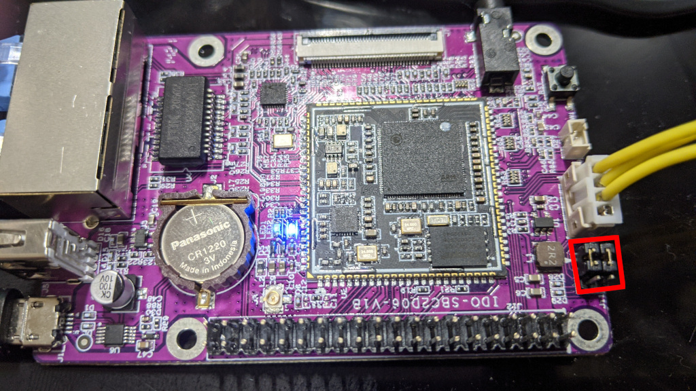

# buildroot_ido-som2d01

Buildroot for ido-som2d01 based boards.

## Wha?

This is a buildroot setup for the various ido-som2d01 based boards.

## Flashing a blank module

- You need to flash at least the CIS blob, the IPL blob and the u-boot SPL.
  Right now you need to do this with the vendor ISP tool. Flashrom can drive
  the i2c interface to write SPI NOR but it cannot do SPI NAND yet so there
  is no alternative right now.

  - See [here](http://linux-chenxing.org/infinity2/ido-som2d01/#flashing) for information on this.
  - Note that the u-boot SPL is currently called `idosom2d01-ipl`. At some point the u-boot SPL will
    replace the vendor IPL blob.

- The main u-boot binary here lives in a UBI partition so that bad block
  recovery etc actually works. You can't do the UBI setup with the ISP tool.
  This is fine. The u-boot SPL is capable of loading the main u-boot binary
  over serial. The first time you boot you need to send u-boot with ymodem.

- Now we need to format the part of the flash we'll use for the UBI
  partitions. `idosom2d01-kernel-rescue.fit` is a micro system with a kernel and just
  enough userland to setup the flash.

- If you board has ethernet you can put `idosom2d01-kernel-rescue.fit` onto a TFTP server
  somewhere and load it via ethernet.

  ```
  setenv loadaddr 0x22000000; dhcp 192.168.3.235:idosom2d01-kernel-rescue.fit; bootm
  ```

- If you don't have ethernet you can load over serial with ymodem. This will be insanely
  slow though so only do this as last resort.

  ```
  setenv loadaddr 0x22000000; loady; bootm
  ```

  Depending on your serial interface you might be able to increase the baud rate
  used during the transfer.

  If you are really lucky something like this might work:

  ```
  setenv loadaddr 0x22000000; loady 0x22000000 460800; bootm
  ```

  Eitherway, you should now be booted in a Linux environment where you can
  finish off flashing the required images.

## Notes for SBC2D06

To write the GCIS, IPL and u-boot SPL on the module on the SBC2D06 you need to move
the jumpers.

This is the position for using the usb port for serial:


This is the position for using the ISP connector for flashing.



You need to move the jumpers into the flashing position when using the the ISP tool
and back again when you need to access the serial console.

### Using the rescue image to complete flashing

- First we need to create the UBI partitions
  ```
  ubiformat /dev/mtd1
  ubiattach -m 1
  ubimkvol /dev/ubi0 -N uboot -s 1MiB -t static
  ubimkvol /dev/ubi0 -N env -s 256KiB
  ubimkvol /dev/ubi0 -N kernel -s 16MiB
  ubimkvol /dev/ubi0 -N rescue -s 16MiB
  ubimkvol /dev/ubi0 -N rootfs -m
  ```
- Now we should pull the rescue image and load it into the rescue partition.
  If something goes wrong once we have the rescue image in the flash it's a lot
  easier to progress. Especially if you are using serial.

  ** tftp instructions here **

  - For serial run `rz` and then send `idosom2d01-kernel-rescue.fit`.
  - Now run:

  ```
  ubiupdatevol /dev/ubi0_3 idosom2d01-kernel-rescue.fit
  ```

- Next we should pull the u-boot image and flash it.

  - For serial run `rz` and then send `idosom2d01-u-boot.img`.
  - Now run:

  ```
  ubiupdatevol /dev/ubi0_0 idosom2d01-u-boot.img
  ```

- At this point your module should be able to boot into u-boot directly
  without needing serial and you should be able to boot back into the resuce
  setup by running:

  ```
  setenv loadaddr 0x22000000; ubi readvol ${loadaddr} rescue 0x800000; bootm
  ```

- Now lets get the kernel and rootfs images
  - For serial run `rz` and then send `idosom2d01-kernel.fit` and `idosom2d01-rootfs.squashfs`
  - Now run:

  ```
  ubiupdatevol /dev/ubi0_2 idosom2d01-kernel.fit
  ubiupdatevol /dev/ubi0_4 idosom2d01-rootfs.squashfs
  ```

- Now everything is flashed, you should be able to boot the normal kernel with a
  more feature rich rootfs. The supplied rootfs is a read only squashfs. If you
  want to use ubifs for a read/write filesystem you can do that but it won't be
  detailed here.

- Have fun!
